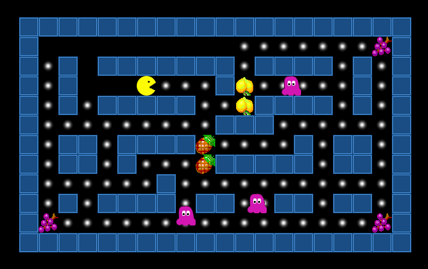

# tilegamelib

A Python library for games based on square tiles.

(c) 2015 Kristian Rother (krother@academis.eu)

Distributed under the conditions of the MIT license.
(some artwork covered by a separate license. See ART_LICENSE.TXT for details)

## Description

tilegamelib helps create mini-games that have graphics consisting of square-shaped tiles (think Sokoban, Pacman, Tetris, Atomix and their countless siblings).

## Installation

It is assumed that you have **Python 3.6** or higher. The instructions here work for Linux and Windows.
I have no idea how pygame works on MacOS.

### Step 1: Install arcade

Follow the documentation of the `arcade` library
(requires C libraries, pip might not handle this).

### Step 2: Install tilegamelib

Next, install tilegamelib:

    pip install tilegamelib

### Development installation

Set the `PYTHONPATH` environment variable to the directory in which this `README` file is.

Alternatively, you can try a local installation using `pip`:

    pip install --editable .

## Play example Games

Run the programs in the `tilegamelib.games` package. They have a command-line script:

    sliding_puzzle
    collect_fruit
    boxes
    snake
    pac

## Write your own mini-game

See the [Beginners Guide](doc/README.md)

## Running automated Tests

    cd test
    python test_all.py

## Classes

Here is an overview of the most important classes

| class | description |
|-------|-------------|
| tilegamelib.Game | Facade for frequently used functions |
| tilegamelib.TiledMap | 2D map composed of tiles |
| tilegamelib.TileSprite | moving object |
| tilegamelib.Vector | x/y coordinates |
| tilegamelib.load_tiles | loads tile graphics |
| tilegamelib.config | global settings |
